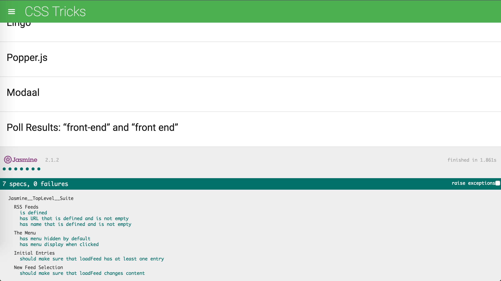

###### Feedreader Testing Project

In this project you are given a web-based application that reads RSS feeds. The original developer of this application clearly saw the value in testing, they've already included [Jasmine](http://jasmine.github.io/) and even started writing their first test suite! Unfortunately, they decided to move on to start their own company and we're now left with an application with an incomplete test suite. That's where you come in.

## Initiate Testing

1. Begin by opening index.html
2. Wait for page to fully load
3. Scroll to the bottom of the page to the section that starts with the Jasmine logo
4. Under 'Jasmine__TopLevel__Suite' there will be titles of testing suites (beginning with 'RSS Feeds')
5. Under each testing suite title there will be a clickable link that will run a specific test (beginning with 'is defined')
6. All tests will run by default, but to carry out only one test you'll need to use the specific link mentioned above

## Functionality

* RSS Feed Testing Suite
	* Tests to make certain that the JSON in 'app.js' has not missing definitions
	* Tests to make certain that the string for 'url' contains something
	* Tests to make certain that the string for 'name' contains something

* Menu Testing Suite
	* Tests to make certain that the menu is hidden when the page loads
	* Tests to make certain that the 'menu-icon-link' toggles the menu

* Initial Entries Testing Suite
	* Tests to make certain that there is at least one entry in the feed

* New Feed Selection Suite
	* Tests to make certain that the feed entries aren't duplicate